# Development of a Database-Driven Web Application for NCEA Level 3

Project Name: **Game Companion Finder**

Project Author: **Riley Nicholls**

Assessment Standards: **91902** and **91903**

-------------------------------------------------

## Design, Development and Testing Log

### 16/05/2024

Planning Database

Previously, the database looked like this. A few parts were unnecessary (the details table, days table) but the times section seemed overcomplicated. After a discussion with Mr. Copley, we identified the parts that needed changing and altered it to:

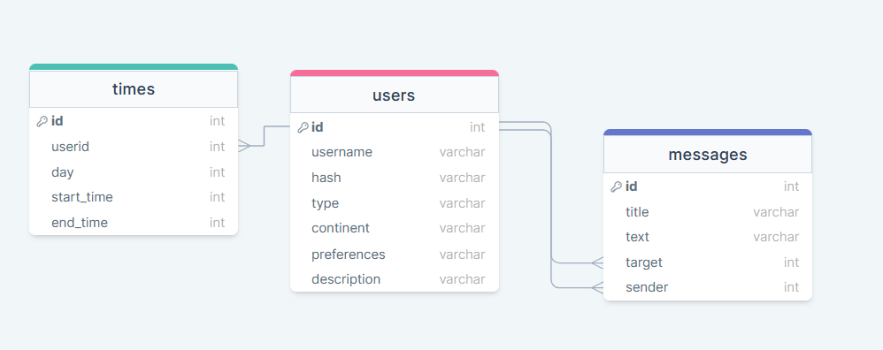

2 tables, the details and days tables, were removed. The details were integrated to the users section, as each user will have their one set of their own unique details (therefore there is no point having a second table to represent that). The days table was removed, as it functionally did nothing (you could represent each day with a single column as a number from 1-7). The times table was then altered to have a start time and end time, because having 24 columns for each time was clunky and overcomplicated, as well as inefficient.

<!-- Replace this text with brief notes describing what you worked on, any decisions you made, any changes to designs, etc. Add screenshots / links to other media to illustrate your notes where necessary. -->

<!-- > Replace this text with any user feedback / comments

Replace this text with notes describing how you acted upon the user feedback: made changes to design, etc. -->

### 17/05/2024

High-Level Design/Flow of App

Made 2 drafts of potential app flow and high-level design.
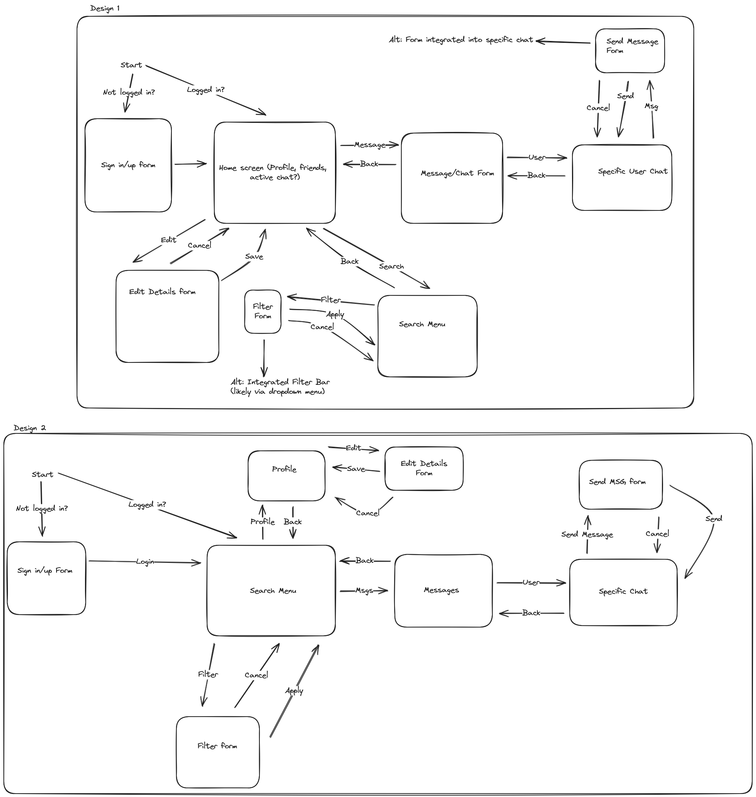

Design 1 would have a home page, which perhaps would display your profile, your friends, etc. From there, you can access every other menu from which to use the app.
Design 2 would default to the search menu as a home page, meaning you can immediately start searching for other users. It would act as the hub from which to access all other pages.
Design 1 feels more consistent and adaptable, if I need to add something I can add another button to the homepage. However, the main function of the app is to search. I'm unsure if users would want the extra step of going to the filtering page to start using the app.
Curious about whether users would like a button that immediately sends them to the home screen, that can be accessed from any view of the app.

To be discussed with the end users. Also will be taking the opportunity to discuss the database draft with them.

### 21/05/2024

Colour Scheme planning

Planned out a few different potential colour schemes, to discuss with end users. Each colour scheme is based on a different design idea.

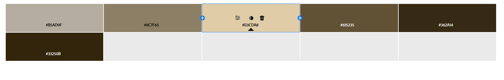

The beige colour scheme tries to draw on more of a boardgame cafe feel. Warm and inviting type of colour scheme.

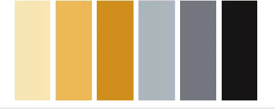

Alternatively, integrate grays and blacks to allow for greater contrast and usability.

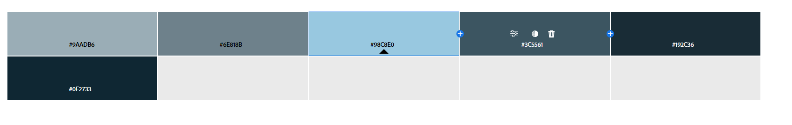

The blues tries to be more video-gamey, sharp and modern. More futuristic, less comfy. Would probably be used in conjunction with a hyper-minimalist type of design.

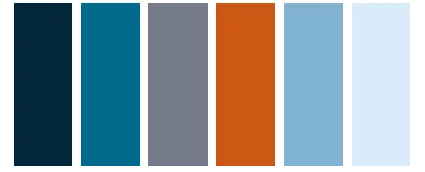

Get better contrast with more orange and gray, alternatively.

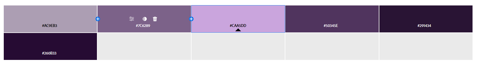

The purple aims to combine the sharp colours of the blue with a more warm feeling from the lighter lavenders. Also because I just really like the colour purple.

This will be the third thing to discuss with my end users. See what colour schemes they like/what kind of feel they support the app going for, as well as any suggestions they may have before actually doing any drafting of what the app looks like.

Note to self: refer to https://www.flux-academy.com/blog/how-to-strategically-use-color-in-website-design

Second note to self: refer to https://lawsofux.com/

<!-- > Replace this text with any user feedback / comments

Replace this text with notes describing how you acted upon the user feedback: made changes to design, etc. -->

### 31/05/2024

Got end user feedback on my current schematics.

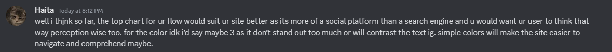

The first higher level flow design will be used. I'll focus on simpler colours for ease of use.

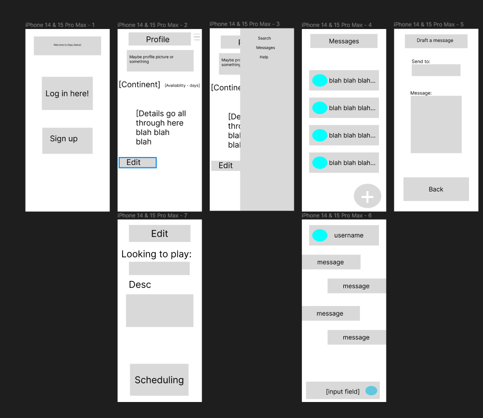
Also made a rough figma draft of the actual website, to be discussed with the end users.

### DATE HERE

Got more end user feedback on higher level flow as well as some design choices from ReptileMan1234 (formerly totallywaffles)
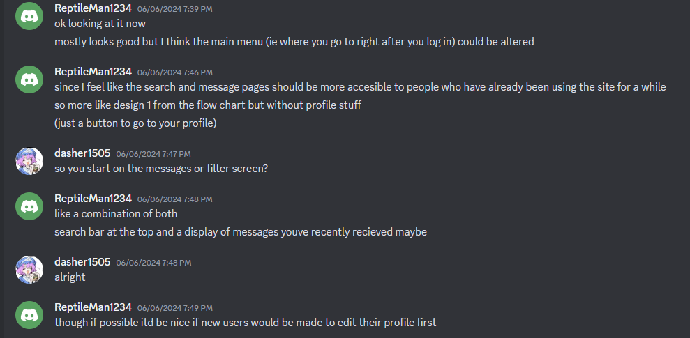

I'm going to look into replacing the profile with the suggestion my end user wanted. This changed the starting screen into looking like this:
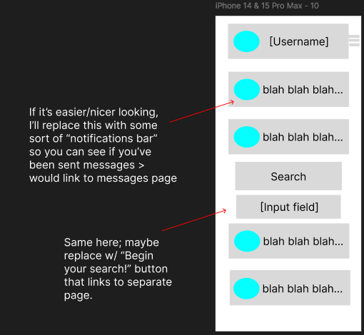

The higher level flow remains relatively similar, but you can immediately search/prepare to message people. This cuts out the stage of "go to filter screen" or "go to messages screen" from the higher level flow. You have to click on the header with your username to get to your profile now, but overall, the amounts of clicks has been reduced.

### DATE HERE

Replace this test with what you are working on

Replace this text with brief notes describing what you worked on, any decisions you made, any changes to designs, etc. Add screenshots / links to other media to illustrate your notes where necessary.

> Replace this text with any user feedback / comments

Replace this text with notes describing how you acted upon the user feedback: made changes to design, etc.
