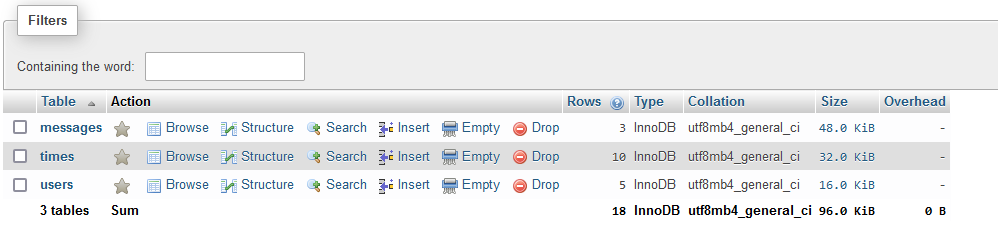

# The Design of a Database-Driven Web Application for NCEA Level 3

Project Name: **Game Companion Finder**

Project Author: **Riley Nicholls**

Assessment Standards: **91902** and **91903**

-------------------------------------------------

## System Requirements

### Identified Need or Problem

It's hard to find people willing to play boardgames, cardgames or videogames just by looking around in person. Many of these games have niche audiences and small communities, often spread across the world. This means it's hard to find people to play with, but also to ensure you want to play with them, or have the time to. A casual gamer doesn't want to play with a competitive player. A player in New Zealand will struggle to play with a player in the United Kingdom, due to timezone differences. An app that allows you to search for people who want to play the same game as you, with a strong filtering system, solves this.

### End-User Requirements

Competitive users: These users tend to want a more competitive style of game. They don't want to play with newer players and destroy them utterly and absolutely. They want good competition. They also want to be able to easily organise matches, with easy-to-use scheduling systems. These players tend to be willing to play at extreme hours, so they'll want to focus more on the skill level of players.

Casual users: These users want a more casual style of game. They don't want to get destroyed by some hyper-competitive player, they want to have fun and relax playing a game. They aren't going to be nearly as willing to play at 3 A.M. This means they'll want a good way to find players in the same timezone. Many may not even know that their game they're playing can be competitive, so an opt-in system to see competitive players may be wise. Finally, these players don't want to put up with "smurfs" (skilled players who intentionally sandbag so they can destroy weaker opponents) so some form of reporting would be key here.

Both these groups are incredibly diverse. They're filled with all sorts of people from all sorts of places, which means the app will need to focus on usability. Some of the users may not be very technologically literate. Note that many hyper-competitive players may also want the opposite, to have a very customizable interface that allows them to streamline their experience as much as possible. As these users are a tiny minority, they will not be the focus, but it is something to think about.

### Proposed Solution

Replace this text with a brief statement about the system that you intend to create, including the key functionality it should have.

I will create an app that allows the user to search through all other users to see who they can play their desired game with. Users will customize their profile to tell other people what they are interested in. The search system will allow users to sort by timezone, by game, etc. They will then be able to have some basic chats on the app to iron out any basic details, with users presumably being able to chat on other apps once they're all happy with each other. In case of toxicity, a method to report this to the administration will be available.
This app will need:
- Account registration
- Logging in feature
- User profile customization
- Some form of basic chat
- Strong search system
- Strong filtering options
- Reporting system???

-------------------------------------------------

## Relevant Implications

### Usability

Usability means making the app easy to use for all users, regardless of how technologically literate they are. This also means ensuring your website is usable for people with disabilities such as colour blindness, etc.

This is perhaps the most relevant implication as many boardgames are filled with people who aren't very technologically literate. The average age of a scrabble player is in the 50's, and older people tend towards being less literate technologically. Older people are also more likely to suffer from some form of disability that means they'll struggle to use apps that do not accomodate for that.

This means I will have to consider usability in every aspect of my website. Making buttons intuitive and easy to understand, making symbols large enough to easily see, not using colours that blend together and make things hard to see. It also means thinking about designing the app in a way that feels consistent and cohesive, e.g different pages should use the same icons and follow the same design ideas as other similar pages.

### Functionality

This means ensuring the website functions the way I as the developer intend it to. This means that every feature should work without error. Making an account should always work, even if the user inputs unexpected characters. Filtering should work, even if the games have unique characters.

This is relevant because an app that lacks functionality simply won't work. You won't have a filtering app, you'll have a waste of space you'll uninstall. Good functionality also future-proofs the app, as good functionality should be strong enough to handle things I don't expect. This would mean the app would require less maintainence from me.

I will need to consider every part of my code. As many parts of it will inevitably be interconnected, such as the "preferred games" and the filtering system, or the users and their messages, it means every piece of code will need to operate and function in order to make other pieces function. This also means I will need to consider whether to error-proof something against unexpected inputs, or to disable that unexpected inputs, and which would be better for the specific task at hand.

### Future Proofing

This means ensuring my app will function throughout the future without requiring any or much maintainence. Insuring it against future problems that may pop up, making sure it works in my abscence.

This is relevant because futureproofing a project reduces the workload on the developer (me) exponentionally. I won't have to check back on the app 24/7 to make sure the end users are getting a working product. It also means that the app will be far more stable. A futureproofed app will generally be reliable and adaptable, meaning that it'll naturally function better against errors and bugs that may emerge. Additionally, there are new games coming out all the time. I can't afford the time to manually input each new game into the database, so futureproofing my app to do something against that will make the app still have purpose 5-10 years into the future.

This means considering how and where to futureproof the app. Will usernames and hashes need to be futureproofed? Probably not. But, will I need to find some way to futureproof the "preferred game" selection? Probably, as new games come out all the time. It means considering whether or not a user-based solution (letting them input their own preferred game) or a developer-based solution (me making sure it'll work for the future) is the best fit for any specific problem that needs future-proofing.

### End-Users

This means making my app with the people who will be using it in mind. Considering what my end users would want, how their perspective differs from mine and others, and integrating that into my app to make sure it suits their needs rather than what I think their needs are.

This is relevant because I can only construct an app around an idea of what I think my end users would want. I don't actually know whether John the middle-aged father of 3 kids wants the features I think he does. If I don't consult him, then I could be totally wrong and he would not use the app even though I designed it with him in mind. This also grants me a new perspective on ideas and features that I may not've thought about or considered to be unnecessary.

This means being in touch with and consulting my end-users constantly. But also, consulting a wide variety of end users. Not just talking with the hyper-competitive scrabble enthusiasts, but also people into more casual experiences. This means taking their ideas into account when designing features for my game and then integrating those ideas to make their experience better and in the way they want it, rather than the way I think they do.

### Cultural Implications

This means considering every culture when making a global-based app. Making sure my app doesn't show bias towards one group, making sure it doesn't contain any insensitive details, taking into account the things that make different cultures feel different ways.

This is relevant because my app is aiming to cater to anyone in any part of the world. Making an insensitive app towards a specific group would be easy if I didn't specifically try to make my app not do so, considering just how many different cultures there are in the world.

This means designing my app to not include inappropriate imagery or allow for inappropriate imagery, but also making sure it presents itself in a culturally neutral way. As users will be able to contribute to the content themselves, it means making sure that there are ways to punish users who attempt to attack other groups and cultures and then remove them from the app.

-------------------------------------------------

## Relevant User Experience (UX) Principles

### Error Prevention

<!-- Replace this text with a clear explanation of what the UX design principle means. -->
This means preventing users from making a mistake or an error. E.G, if you can't have certain characters in your username, just don't let the user type them/don't accept their username if it has any. It also means granting the user a back-out option if possible, to prevent them from making an irreversible mistake on an option.

<!-- Replace this text with an explanation of why the principle is relevant to this particular project. -->
This is relevant since this app is meant to have such a broad scope. This would mean, ideally, that there are thousands of users operating the app at a time. This means that rare bugs and errors are eventually going to impact people by virtue of sheer scale. Additionally, with such a broad userbase, there are going to be people that constantly fat-finger the wrong button and don't mean to press it. Adding an option to backout prevents these people from accidentally deleting their account or something of a similar nature.

<!-- Replace this text with an explanation of what you will need to consider moving forward and how the project will be impacted by this principle. -->
This means considering where and when to error proof my app. Do I error proof when users decide on a username, so an invalid username never hits the database in the first place? Do I make my database immune to invalid inputs in the off-chance someone manages to get through my error prevention? Is it worth the extra time to implement? This applies to everything that will need some form of error prevention, and weighing the benefit relative to how much time it takes to implement will be key. Additionally, adding a confirmnation option on every major irreversible decision would be wise.

### Recognition Rather than Recall

<!-- Replace this text with a clear explanation of what the UX design principle means. -->
This means making my app not rely on the user remembering every little detail to proceed to the next step of using my app. Instead, granting the user something they can easily recognise, like a symbol, or simply removing the entire step of remembering something alltogether.

<!-- Replace this text with an explanation of why the principle is relevant to this particular project. -->
With an app that needs a strong filtering system, there is inevitably going to be some clash over how I make sure every option shows up in a filter whilst allowing users to not have to remember every single option available. If you're trying to contact someone through the app again to arrange playing a game, you don't want to have to remember _xX_AlB@Tr0ss-D3sTr0yAh_Xx_ every time you want to talk to them. This is especially relevant to people who may struggle with memory.

<!-- Replace this text with an explanation of what you will need to consider moving forward and how the project will be impacted by this principle. -->
This means considering how to integrate that recognition over recall idea. In practice, it's not very efficient to grant the user a massive drop-down list of every single boardgame, videogame, etc they can filter by. This means instead of relying on those massive lists, letting the app somehow remember what the user previously inputted, who they previously chatted to, etc. It means thinking about how and when to use those lists and pre-curated options and when to force the user to have to have that tiny bit of recall. Ideally, it also means making sure that even if you don't recall things very well, the app will remain easy to use.

### Visibility of System Status

This means making sure the user knows what's going on inside the system. When they click a button, they should get feedback that the system is now responding to that button press.

This is relevant to my app (but really any app) because a lack of information confuses users and can lead to mistakes. If there's no visible response when the user creates an account, they might keep making accounts until they catch on. If the users try to send a message but don't get told the message was sent, they have no way to tell if they've actually managed to communicate with the other person. This can be particularily relevant for my project as there will be many casual users who do not have the patience or time to try work through some esoteric app.

This means considering when and where to tell the user that a task or request is being processed. Maybe the users shouldn't be told that they've successfully toggled a filter; rather, that should just work and they'll see the result of it working. But, if the user wants to update their profile or change their available times, maybe they should be told that it's updated successfully. Thinking when it's viable to not tell the user that something has happened and where it is necessary to avoid making the app cumbersome to use is key.

### Help Users Recognize, Diagnose, and Recover from Errors

<!-- Replace this text with a clear explanation of what the UX design principle means. -->
This means giving the end user some helpful messages when they do get an error, to tell them what went wrong, why, and how they can fix the problem. Making sure the user isn't confused by what went wrong and giving them a clear solution to their problem.

<!-- Replace this text with an explanation of why the principle is relevant to this particular project. -->
This is relevant because presumably most people using the app will not be techno-wizards who can instantly recognise ERROR CODE X41119234856200. They'll be the ordinary person. If they come across an error and don't know what they did to cause it and how to resolve it, then they're unlikely to want to google "how to solve ERROR CODE X41119234856200". They'll just give up. We want to make sure the users have a good experience when they're using the app, and that the first struggle they have doesn't make them call it quits.

<!-- Replace this text with an explanation of what you will need to consider moving forward and how the project will be impacted by this principle. -->
This means I will have to consider what errors will need those obvious "do x, y and z to fix" messages but also what problems will require the users to simply report it to a developer. I'll need to make sure all of those error messages that occur from simple problems are easy to understand and follow, perhaps by testing it on my less techy friends. This means for those complex problems, making sure the user knows how to contact a developer/the administration to get that help they might need.

### Help and Documentation

This means making a system that needs minimal documentation for users. However, all documentation that does exist should be short to read, that doesn't use jargon, and users shouldn't have a hard time accessing it. In essence, making sure the user can always easily access help and then easily digest the information contained within the documentation for that help.

This is relevant because people will inevitably be confused with such a large end user base. Some people may not understand how or update or edit their preferences for games, or how to go about searching for a user, or how to change their available times. We take these as givens, but many people who enjoy boardgames may barely touch apps like this and so would like the extra help. It's helpful that many people who enjoy games or boardgames tend to be okay with a bit of reading, so they might also like that documentation simply to wrap their head around how everything works.

This means asking the end users what they think is confusing and what they don't understand intuitively. Choosing when it's better to redesign something to become more intuitive or when to add documentation on how to use that feature is smart; if a key feature needs documentation when it should be simple, something has gone wrong. Also, when asking end-user feedback for this, specifically ask people who are the least likely to understand how to intuitively use the app, since they'll be the main ones who will need to use that documentation.

-------------------------------------------------

## Final System Design

### Database Structure

Place a image here that shows the *final design* of your database: tables, fields and relationships.

### User Interface Design

Place images here that show your *final design* of your UI: layout, colours, etc.

-------------------------------------------------

## Completed System

### Database Structure

Place a image here that shows the *actual database structure* that you implemented: tables, fields and relationships.

### User Interface Design

Place screenshots and notes here that show your *actual system UI* in action.

-------------------------------------------------

## Review and Evaluation

### Meeting the Needs of the Users

I initially identified two kinds of users; the casual boardgame players and the competitive boardgame players. As I developed my project, I found myself more designing around the casual player, by making my website focus around operating purely on a continent-to-continent basis rather than allowing for exceptions. This means competitive players can’t find other competitive players anywhere, when they might be willing to play at extreme times. I feel this is justifiable, though, given many competitive games still only allow match-making in the same regions. Additionally, the competitive boardgame playerbase is vastly smaller than the casual playerbase, and catering my website to the needs of the very few instead of the needs of the very many seemed silly. 

On the ease of use, I gave my website some helpful notes and documentation as well as explanations wherever necessary. I used red to indicate a delete button, and made buttons light up when hovered over to indicate clickability. I think these measures make the website much more usable for people new to websites. 

### Meeting the System Requirements

I initially wanted account registration, logging in, profile customization, some form of chat, as well as a strong search and filter system. I believe I accomplished all of these. 

You can make an account and log in as it, and this was implemented to the standard of most websites. Nothing breaks whilst trying to make an account, for example. 

I also added basic profile customization. Users can change their profile description, what game they want to play, as well as their own continent and whether they’re a casual or competitive player. This gives the users some measure of customising their own profile, but I could’ve pushed for adding profile images too if I had the time. 

There was a basic messaging system implemented, as well. Users can easily send and receive messages from users who they can play with. They can easily delete messages if needed, and there’s an alert ticker for messages. I think this feature was implemented well, but the chat was replaced with more of an email style system. However, there are many chat apps out there, and the mail system acts more as an intermediary before users move to chat on a different platform. 

The search and filtering systems were one and the same. At the cost of user customizability of the filter system, I had it done automatically. Users don’t need to toggle filters, because the website will automatically find all players that they can play with given their schedules, preferences, continent and player type. I think this trade-off made the website better for the more casual end users, as it reduces the amount of learning and clicking they need to do to use the website, making it simpler to use. This auto-filter then acts as a search, given that you’re finding all eligible users to play with. I believe this feature was implemented well. 

### Review of Functionality

Replace this text with brief notes showing how the implication was addressed in the final outcome. Accompany the notes with screenshots / other media to illustrate specific features.

The website was fully functional and worked as intended. You could easily sign up or login. All invalid inputs were rejected successfully. You could then create one schedule per day, and invalid times were rejected. The filtering worked with no errors, with only valid schedules being displayed on the filtered list. You could then send messages without any problems, and read messages you'd received. Overall, the website functioned without issue, meaning this implication was fully met with success.
Evidence of working functionality can be seen in the error-checking video, shown here:

### Review of Usability

Replace this text with brief notes showing how the implication was addressed in the final outcome. Accompany the notes with screenshots / other media to illustrate specific features.

The website became quite useable, I'd say. It has a traditional navigation layout at the top right with underlined links (arguably the weakest part of my website's usability) with pretty self-identifying names, like "Help" or "Search" or "Messages". This should make it clear to users that these are links to pages. Then, every clickable button lights up when the cursor is hovered over it, or reads "Submit" or "Complete Edit", meaning all the buttons should intuitively feel quite obvious to the user. Finally, the bright white font contrasts well with the dark blue website, making it easy to read. All of this congeals to meet the usability requirements I laid out earlier, and I believe this implication was adequately met. Something to improve upon was the final form; 'preferences' is not immediately obvious to a new user, which is why I changed it, but it also leaves room for misspelling on the user end. This reduces the usability somewhat.
Evidence photos:

### Review of Future-Proofing

Replace this text with brief notes showing how the implication was addressed in the final outcome. Accompany the notes with screenshots / other media to illustrate specific features.

This website was designed with the future in mind. The first way I did this was making sure it was only an intermediary app. Instead of all messaging being done on the app, the messaging features were left rather light-weight to incentive going to a different messaging platform. Users can also delete their messages, avoiding inbox clogging all on their own. On the games front, users can input whatever game they want to play in their preferences. This means I don't have to constantly update a list of popular games to ensure the filtering encompasses all users. Instead, users can input new games all on their own, meaning the website should function well into the future. I'd say this implication was fully met.

### Review of IMPLICATION NAME HERE

Replace this text with brief notes showing how the implication was addressed in the final outcome. Accompany the notes with screenshots / other media to illustrate specific features.

### Review of UX PRINCIPLE NAME HERE

Replace this text with brief notes showing how the UX principle was addressed in the final outcome. Accompany the notes with screenshots / other media to illustrate specific features.

### Review of UX PRINCIPLE NAME HERE

Replace this text with brief notes showing how the UX principle was addressed in the final outcome. Accompany the notes with screenshots / other media to illustrate specific features.

### Review of UX PRINCIPLE NAME HERE

Replace this text with brief notes showing how the UX principle was addressed in the final outcome. Accompany the notes with screenshots / other media to illustrate specific features.
