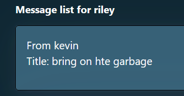
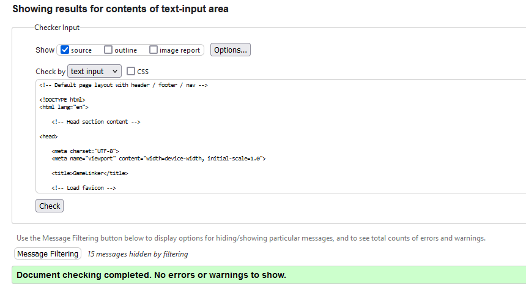

# Development of a Database-Driven Web Application for NCEA Level 3

Project Name: **Game Companion Finder**

Project Author: **Riley Nicholls**

Assessment Standards: **91902** and **91903**

-------------------------------------------------

## Design, Development and Testing Log

### 16/05/2024

Planning Database

Previously, the database looked like this. A few parts were unnecessary (the details table, days table) but the times section seemed overcomplicated. After a discussion with Mr. Copley, we identified the parts that needed changing and altered it to:

2 tables, the details and days tables, were removed. The details were integrated to the users section, as each user will have their one set of their own unique details (therefore there is no point having a second table to represent that). The days table was removed, as it functionally did nothing (you could represent each day with a single column as a number from 1-7). The times table was then altered to have a start time and end time, because having 24 columns for each time was clunky and overcomplicated, as well as inefficient.

<!-- Replace this text with brief notes describing what you worked on, any decisions you made, any changes to designs, etc. Add screenshots / links to other media to illustrate your notes where necessary. -->

<!-- > Replace this text with any user feedback / comments

Replace this text with notes describing how you acted upon the user feedback: made changes to design, etc. -->

### 17/05/2024

High-Level Design/Flow of App

Made 2 drafts of potential app flow and high-level design.

Design 1 would have a home page, which perhaps would display your profile, your friends, etc. From there, you can access every other menu from which to use the app.
Design 2 would default to the search menu as a home page, meaning you can immediately start searching for other users. It would act as the hub from which to access all other pages.
Design 1 feels more consistent and adaptable, if I need to add something I can add another button to the homepage. However, the main function of the app is to search. I'm unsure if users would want the extra step of going to the filtering page to start using the app.
Curious about whether users would like a button that immediately sends them to the home screen, that can be accessed from any view of the app.

To be discussed with the end users. Also will be taking the opportunity to discuss the database draft with them.

### 21/05/2024

Colour Scheme planning

Planned out a few different potential colour schemes, to discuss with end users. Each colour scheme is based on a different design idea.

The beige colour scheme tries to draw on more of a boardgame cafe feel. Warm and inviting type of colour scheme.

Alternatively, integrate grays and blacks to allow for greater contrast and usability.

The blues tries to be more video-gamey, sharp and modern. More futuristic, less comfy. Would probably be used in conjunction with a hyper-minimalist type of design.

Get better contrast with more orange and gray, alternatively.

The purple aims to combine the sharp colours of the blue with a more warm feeling from the lighter lavenders. Also because I just really like the colour purple.

This will be the third thing to discuss with my end users. See what colour schemes they like/what kind of feel they support the app going for, as well as any suggestions they may have before actually doing any drafting of what the app looks like.

Note to self: refer to https://www.flux-academy.com/blog/how-to-strategically-use-color-in-website-design

Second note to self: refer to https://lawsofux.com/

### 31/05/2024

Got end user feedback on my current schematics.

The first higher level flow design will be used. I'll focus on simpler colours for ease of use.

Also made a rough figma draft of the actual website, to be discussed with the end users.

### 06//06/2024

Got more end user feedback on higher level flow as well as some design choices from ReptileMan1234 (formerly totallywaffles)

I'm going to look into replacing the profile with the suggestion my end user wanted. This changed the starting screen into looking like this:

The higher level flow remains relatively similar, but you can immediately search/prepare to message people. This cuts out the stage of "go to filter screen" or "go to messages screen" from the higher level flow. You have to click on the header with your username to get to your profile now, but overall, the amounts of clicks has been reduced.

### 02/08/2024

Having developed much of the website's functionality, I prematurely decided to change a few aspects of the design. The message board idea I had, where it was much like a mobile phone's texting (messages from you coming in on the right side, messages from the other user coming in from the left) but I didn't really have any ideas on how to properly code it. I knew I could learn how to develop it, but I felt that it wasn't worth the time investment. Therefore, I settled for this design: 

This design is obviously in the early stages, but I feel it can be improved and works for the purposes of my website whilst not taking a massive time investment to get functional.

I also had a long conversation with my end users (ignore the highly dangerous swear word I accidentally left it) as shown by this video: https://www.youtube.com/watch?v=z-tSIrQqpuo

Based on this feedback, I'll make sure to adjust the home page to act as the search screen for the user.
I acted on the feedback today, as well. The profile button has been adjusted to be the username of the user. From this: 

to this:

and I also made changes to the way the filtered list of users you can play with presents itself. Now, it shows every user who can play with you, and you click on their name to see what times you can play with them. The filtered list of users now looks like this:

### 06/08/2024

Added delete buttons to necessary screens. Schedules can change, and messages will start to clog up if you have too many.
Schedule list:
Before:

After:

Messages:
Before:

After:

Button will ideally be moved to the right, rather than being below the details.

Also changed login/signup page to use buttons instead of being a massive mess where the forms just start off on the page. Now looks like:

Finally, fixed my forms so that you cannot exceed the maximum length allowed by the database (thereby breaking the site).  E.G:
Before:

After:

I have also attempted to act on user feedback by making the default page after logging in the filter page, but I feel that wasn't meeting the spirit of what they wanted.
I'm going to gather more information about what the end user wants when he means, "The home page shows the filtered user list." to get a better picture of what to change.

### 08/08/2024

Added display if user has no messages, to tell them they don't:

More specifically, I attempted to act on user feedback about the message display. Now the user will see how many messages they have without needing
to go onto the messages page. This count will re-check and update every time a page refreshes. I couldn't figure out how to make it only show when you have
new messages, and only display the number of un-viewed messages. However, this still tells you how many messages you have,
and it encourages users to delete messages after reading (preventing major clogging). So, I believe this should be a good compromise.

### 09/08/2024

Added a functional back button to the login/signup forms:

Now the user doesn't have to hit the home button in order to return to the signup/login page.

### 11/08/2024

Had a meeting with my end users, where we went over changes. Video here: https://youtu.be/jAH_M5KCB_s
User recommended replacing the home page with a help or FAQ page, maybe describing the website and what it does.

### 13/08/2024

I addressed the user's feedback, by adding an "About Us" button to the home page that users see before logging in. I then remade the home page to be more of an info page,
in line with user feedback, providing a rough overview of what the app does and how to use it.

I also began working on the website design and CSS. I split up the lists into distinct buttons that change colour when hovered over (placeholder colours):

I'll be using the colour palette my end user said to at the start, before getting some finalised feedback on colour design.

### 15/08/2024

Final discussion with end users, having fixed up the website and made final design touches: https://youtu.be/n6h0BVZvIkk
I will change the text colour in accordance with what they want.

### 16/08/2024

Made the requested text colour change: 
Now text is white instead of black universally.

Validated my HTML:
Note that all ignored 'errors' are just HTMX.

 - Search

 - Profile

 - Search

 - Help (logged in)

 - Help (not logged in)

There were no non-HTMX errors on my page, so everything seems to be working.

### 10/08/2024

Replace this test with what you are working on

Replace this text with brief notes describing what you worked on, any decisions you made, any changes to designs, etc. Add screenshots / links to other media to illustrate your notes where necessary.

> Replace this text with any user feedback / comments

Replace this text with notes describing how you acted upon the user feedback: made changes to design, etc.

### 10/08/2024

Replace this test with what you are working on

Replace this text with brief notes describing what you worked on, any decisions you made, any changes to designs, etc. Add screenshots / links to other media to illustrate your notes where necessary.

> Replace this text with any user feedback / comments

Replace this text with notes describing how you acted upon the user feedback: made changes to design, etc.

### 10/08/2024

Replace this test with what you are working on

Replace this text with brief notes describing what you worked on, any decisions you made, any changes to designs, etc. Add screenshots / links to other media to illustrate your notes where necessary.

> Replace this text with any user feedback / comments

Replace this text with notes describing how you acted upon the user feedback: made changes to design, etc.